# api-blood-donation

## install dependencies
`npm install` or `npm i express mongoose bcryptjs jsonwebtoken dotenv cors`

## how to run the API
### Option 1
`npm start`

### Option 2
`node server.js`

## API Routes
🔒 the routes that has this emoji means that requires { 'Authorization': Bearer AccessToken } header
 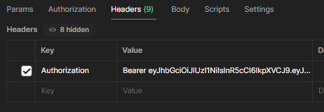 
### Authentication
| Purpose                | Method | Route                          | Consumes                                                                                                                                                     | Returns                                                      |
|------------------------|--------|--------------------------------|--------------------------------------------------------------------------------------------------------------------------------------------------------------|--------------------------------------------------------------|
| Register               | POST   | `/api/auth/register`           | if it's a person: 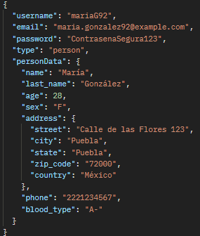 if it's an institution: 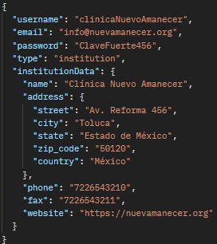  | 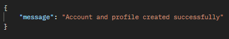       |
| Login                  | POST   | `/api/auth/login`              | with email: 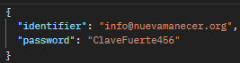 with username: 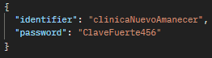                  | 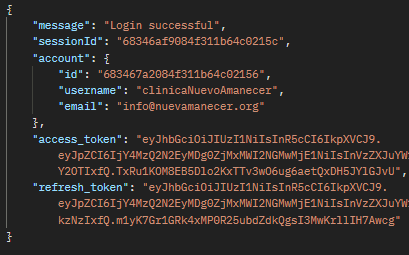          |
| Logout 🔒              | POST   | `/api/auth/logout`             | Nothing                                                                                                                                                      | { "message": "Logout successful" }                           |
| Get a new access token | POST   | `/api/auth/token/access-token` |  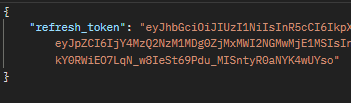                                                                                                   |  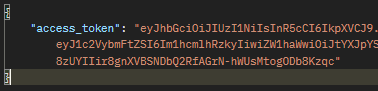  | 

### Donor
| Purpose           | Method | Route         | Consumes                                                    | Returns                                             |
|-------------------|--------|---------------|-------------------------------------------------------------|-----------------------------------------------------|
| Become a donor 🔒 | POST   | `/api/donor/` |  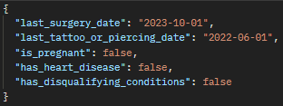  | 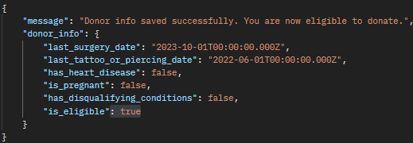 |

### Blood request
| Purpose                    | Method | Route                 | Consumes                                             | Returns                                              |
|----------------------------|--------|-----------------------|------------------------------------------------------|------------------------------------------------------|
| Create a blood request 🔒  | POST   | `/api/blood-request/` | 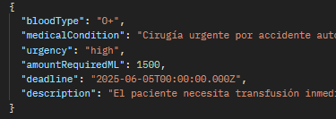 | 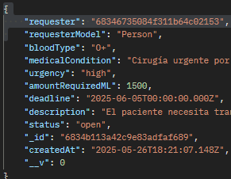 |
| Get all the blood requests | GET    | `/api/blood-request/`   | Nothing                                              | |