# api-blood-donation

## install dependencies
`npm install` or `npm i express mongoose bcryptjs jsonwebtoken dotenv cors`

## how to run the API
### Option 1
`npm start`

### Option 2
`node server.js`

## API Routes
🔒 the routes that has this emoji means that requires to be logged in to be used { 'Authorization': Bearer AccessToken } header
  
### Authentication
| Purpose                | Method | Route                          | Consumes                                                                                                                                                     | Returns                                                      |
|------------------------|--------|--------------------------------|--------------------------------------------------------------------------------------------------------------------------------------------------------------|--------------------------------------------------------------|
| Register               | POST   | `/api/auth/register`           | if it's a person:  if it's an institution:   |        |
| Login                  | POST   | `/api/auth/login`              | with email:  with username:                   |           |
| Logout 🔒              | POST   | `/api/auth/logout`             | Nothing                                                                                                                                                      | { "message": "Logout successful" }                           |
| Get a new access token | POST   | `/api/auth/token/access-token` |                                                                                                     |    | 

### Account
| Purpose                  | Method | Route             | Consumes                                                                  | Returns                                                       |
|--------------------------|--------|-------------------|---------------------------------------------------------------------------|---------------------------------------------------------------|
| Get data from account 🔒 | GET    | `/api/account/me` | Nothing                                                                   | 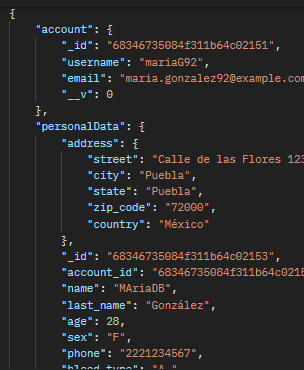          |
| Edit account 🔒          | PUT    | `api/account/me`  | Fields to update  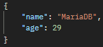 | 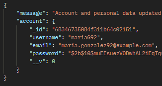          |
| Delete account 🔒        | DELETE | `/api/account/me` | Nothing                                                                   | { "message": "Account and linked data deleted successfully" } | 

### Donor
| Purpose            | Method | Route                | Consumes                                                    | Returns                                              |
|--------------------|--------|----------------------|-------------------------------------------------------------|------------------------------------------------------|
| Become a donor 🔒  | POST   | `/api/donors/`       |    |   |
| Search donors * 🔒 | GET    | `/api/donors/search` | Nothing                                                     | 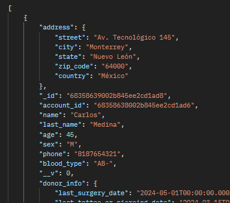 |
* Search donor looking can be filtered.  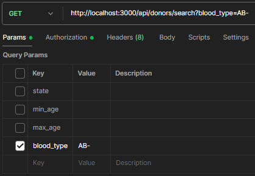 

### Blood request
| Purpose                          | Method | Route                                        | Consumes                                                                   | Returns                                              |
|----------------------------------|--------|----------------------------------------------|----------------------------------------------------------------------------|------------------------------------------------------|
| Create a blood request 🔒        | POST   | `/api/blood-requests/`                       |                        |  |
| Get all the blood requests 🔒    | GET    | `/api/blood-requests/`                       | Nothing                                                                    | 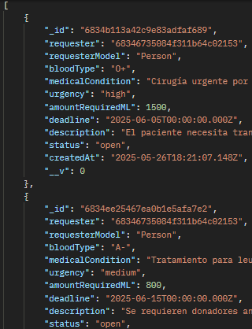 |
| Get a blood request by its id 🔒 | GET    | `/api/blood-requests/:id`                    | Nothing                                                                    | 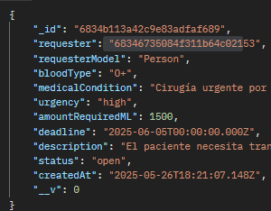 |
| Edit a blood request 🔒          | PUT    | `api/blood-requests/:id`                     | Fields to update   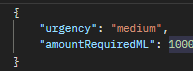 | 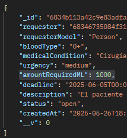 |
| Delete a blood request 🔒        | DELETE | `api/blood-requests/:id`                     | Nothing                                                                    | { "message": "Blood request deleted successfully" }  | 
| Apply for a blood request 🔒     | POST   | `/api/blood-requests/application/:requestId` | Nothing                                                                    | 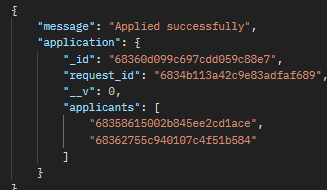   | 
| Search blood requests 🔒         | GET    | `/api/blood-requests/search`                 | Nothing                                                                    | 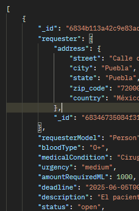   |
* Search blood requests can be filtered  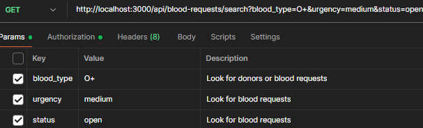 

### Contact 
| Purpose                              | Method | Route                   | Consumes | Returns                            |
|--------------------------------------|--------|-------------------------|----------|------------------------------------|
| Contact a person or institution * 🔒 | GET    | `/api/contact/whatsapp` | Nothing  | { "link": "https://wa.me/number" } |
* The route uses targetId and targetType query params  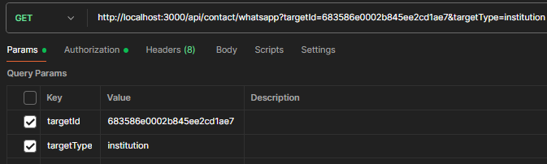